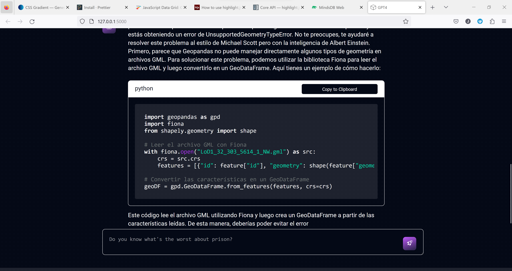

# GPT-4 custom chatbot

## Description
This project creates a gpt-4 chatbot from [OpenAI's](https://github.com/openai) GPT-4 model using third party provider [mindsdb](https://mindsdb.com). It is not a deployment ready application and not intended to replace OpenAIs gpt4 functionality but rather for educational purpose. However, you can use it to learn about GPT-4, customize your own chatbot and compare it against the GPT 3.5 model.

To use the chatbot follow the instructions below!

## Installation

## License
This project is for local usage only. Please dont integrate it in any comercial project! If you decide to use the chat bot or the code in any form of media (e.g. a youtube video), please refer to this repo and name the author: Jannes Kruse.

Apart from that: Happy chatting:D

# External packages and software used in this repo

- OpenAI's GPT-4 via mindsdb
    - mindsdb's [python api](https://docs.mindsdb.com/sdk/python-sdk)
- flask for using python with html
- jquery for working with the DOM
- highlight.js for code highlighting
