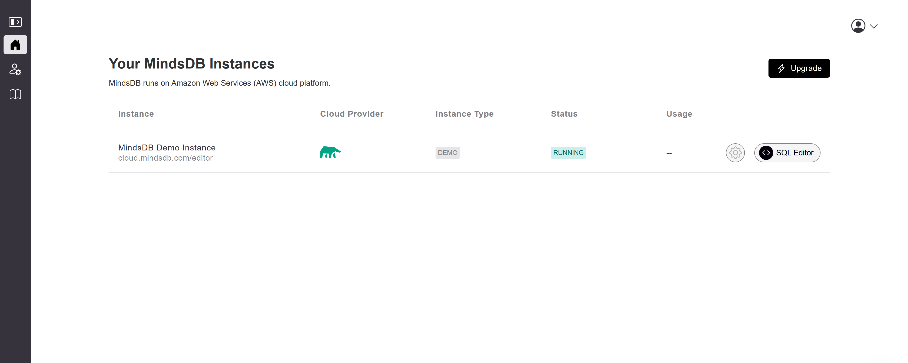
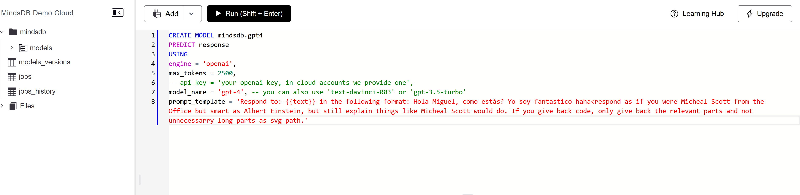

# GPT-4 custom chatbot

## Description
This project creates a gpt-4 chatbot from [OpenAI's](https://github.com/openai) GPT-4 model using third party provider [mindsdb](https://mindsdb.com). It is not a deployment ready application and not intended to replace OpenAIs gpt4 functionality but rather for educational purpose. However, you can use it to learn about GPT-4, customize your own chatbot and compare it against the GPT 3.5 model.


To use the chatbot follow the instructions below!


<br>
<br>
<br>

## Installation

The following will need some knowledge in using the command line. If you are stuck with one of the steps, ask chatGPT;P

### 1. Clone or download the git repository

### 2. Install the necessary dependencies (python packages). Personally, I would recommend conda or mamba to handle them.

- Using pip package manager (conda/mamba install pip):

```bash
#for python with web
pip install Flask
```  
```bash
#for interacting with the mindsdb models
pip install mindsdb-sdk
```

- You will need a python interpreter to do so!

### 3. Create an account at [mindsDB](https://mindsdb.com/) and navigate to your dashboard (going back button)


### 4. Click on the Demo Instance and use the sql editor to create a new model



Here, you use the following SQL code to create the model, which creates a chatbot 

```sql
CREATE MODEL mindsdb.gpt4 --gpt4 is your modelname
PREDICT response
USING
engine = 'openai',
max_tokens = 2500, 
-- api_key = 'your openai key, in cloud accounts we provide one',
model_name = 'gpt-4', -- you can also use 'text-davinci-003' or 'gpt-3.5-turbo'
prompt_template = 'Respond to: {{text}} in the following format: Hola Miguel, como estás? Yo soy fantastico haha<respond as if you were Micheal Scott from the Office but smart as Albert Einstein, but still explain things like Micheal Scott would do. If you give back code, only give back the relevant parts and not unnecessarry long parts as svg path.' --modify this to your needs. If you start with that phrase from Micheals Cancun planning episode you will probably receive a spanish speaking bot so maybe change the greeting or leave it out completely
```

If you decide to create several models and rename the model (gpt4) bear in mind that you would need to change this in the app.py:

```python
query = project.query(f'SELECT response from mindsdb.gpt4 WHERE author_username = "mindsdb" AND text="{formatted_conversation}";')
```

### 5. Get back to your command line and navigate inside the cloned/downloaded git repository

```bash
cd gpt-4-costum-bot
```

### 6. Execute the application by running:

```bash
python app.py
```

**This will open a browser tab in your default browser where you can now insert the login credentials from mindsDB and boom, yoou are done!**


<br>
<br>
<br>

## License
This project is for local usage only. Please dont integrate it in any comercial project! If you decide to use the chat bot or the code in any form of media (e.g. a youtube video), please refer to this repo and name the author: Jannes Kruse.

Apart from that: Happy chatting:D


<br>
<br>
<br>

# External packages and software used in this repo

- OpenAI's GPT-4 via mindsdb
    - mindsdb's [python api](https://docs.mindsdb.com/sdk/python-sdk)
- flask for using python with html
- jquery for working with the DOM
- highlight.js for code highlighting
